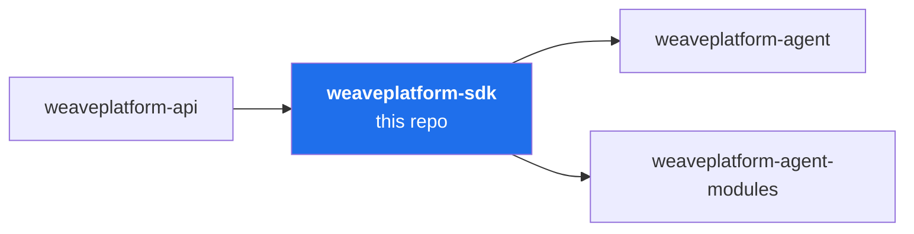

# weaveplatform-sdk

The library layer of the Weave platform agent: what modules (and core) build on. Depends only
on `weaveplatform-api` and infrastructure (grpc, x/sys). `CGO_ENABLED=0` throughout — this is
a Zone A library.

## Packages

| Package | What |
|---|---|
| `modulesdk` | The module runtime: implement `Module`, call `modulesdk.Serve(m)` — handshake, lifecycle dispatch, health serving and the `Host` client are handled for you |
| `modulesdk/testkit` | Fake `Host`, in-memory store/policy/bus, and the protocol-compat harness every module's CI runs |
| `platform` | The thin OS seam: host info, well-known paths, session helpers. **No bindings re-exports** — modules link `go-bindings-*` directly at protocol-pinned versions |
| `werror` | Error conventions: sentinels + wrapping |
| `wlog` | `slog` construction; module logs stream to core after Init |
| `config` | Handshake-delivered config document > env > defaults; no files, no viper |
| `retry` | Exponential backoff with full jitter; policy calculator, not a loop runner |

## Writing a module

Start with [`docs/writing-a-module.md`](docs/writing-a-module.md) — the Module interface,
the Host surface, health semantics, the manifest, and testing with `testkit.StubCore`. Then
copy [`sysinfo`](https://github.com/deploymenttheory/weaveplatform-agent-modules/tree/main/sysinfo),
which exists to be copied.

## Rules

- **Host is closed by default** (spec §5). This SDK grows by design review, not accretion.
- Modules never import each other, never open their own sockets, never draw UI.
