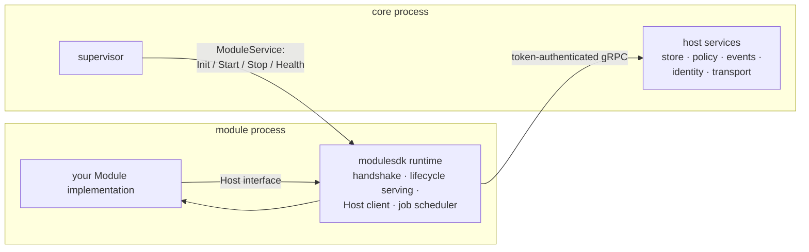

# Writing a module

A module is one product's device-side half: a separate signed binary that core launches,
supervises, and speaks gRPC to over a local socket. You implement one interface; the SDK
runtime handles everything on the wire.

The rules come from
[spec §5](https://github.com/deploymenttheory/weaveplatform-agent/blob/main/spec.md):
modules never import each other, never open their own sockets, never draw UI, and `Host` is
closed by default — a module needing a new host method is an architecture decision, not a
pull request.

## The shape

```go
package main

import "github.com/deploymenttheory/weaveplatform-sdk/modulesdk"

func main() { modulesdk.Serve(myproduct.New()) }
```

`Serve` reads the handshake environment core sets, negotiates the protocol (exiting cleanly
if core's window excludes this SDK's protocol), listens on the module socket, answers the
one-line handshake, and dispatches core's lifecycle RPCs onto your implementation:

```go
type Module interface {
    ID() string
    Requires() []Capability            // gates launch against the host probe
    Init(context.Context, Host) error  // wire up; declare surfaces; read policy
    Start(context.Context) error       // begin doing the product's work
    Stop(context.Context) error        // drain within the deadline
    Health() Health                    // healthy / degraded / unhealthy
}
```

Optionally implement `ConfigReceiver` (`SetConfig(doc []byte) error`) to receive the
core-delivered configuration document before `Init`.

## What runs where



Everything your module needs from the platform comes through `Host`:

| Surface | What it is | Notes |
|---|---|---|
| `Store(ns)` | encrypted key/value, namespaced to your module | you can never reach another module's namespace |
| `Policy()` | read + watch your policy document | host-delivered policy beats anything local; **watch on a module-lifetime context, not Init's** — Init's context is cancelled the moment Init returns |
| `Events()` | publish/subscribe bus | topics arrive prefixed with the publisher's id, stamped by core — origins are trustworthy; the only lateral channel between modules |
| `Transport()` | send/receive via core's authenticated channels | `queueOffline: true` survives a disconnected peer |
| `Identity()` | who the device is + module-scoped credentials | you never see private keys |
| `UI().Declare(...)` | declare surfaces as data | the portal renders; modules never draw |
| `Schedule(Job)` | recurring work | runs once at Start, then every interval; stops with the module |
| `Log()` | `*slog.Logger` | captured and attributed by core |

**Health is a vocabulary, not a boolean.** Report `Degraded` with a reason when a backend
you need is temporarily absent (no display session yet, device unplugged) — the supervisor
restarts `Unhealthy` modules, not degraded ones. Failing `Init` because a backend is missing
turns a recoverable condition into a crash loop.

## The manifest

Every module declares a `module.manifest.json` — id, version, protocol, zone, privilege,
session placement, platforms, capabilities, signing identity. Core gates launch on it and
verifies the binary against it before every exec. Schema:
[`module-manifest.schema.json`](https://github.com/deploymenttheory/weaveplatform-api/blob/main/schema/module-manifest.schema.json).
Declare the least privilege that works (`service`, not `system`), and declare per-user
session placement rather than discovering at runtime that session 0 has its own clipboard.

## Testing

`modulesdk/testkit` gives you both halves:

- `testkit.NewHostData()` + the in-memory host services — unit-test your module logic
  without processes.
- `testkit.StubCore` — spawns your **built binary**, performs the real core-side handshake,
  and drives Init/Start/Health/Shutdown. Its `HostData` records every store write, event
  publish and transport send your module makes, so integration tests assert real behaviour:

```go
core := &testkit.StubCore{ModuleID: "myproduct", Capabilities: []string{"platform.osinfo"}}
proc, err := core.Launch(ctx, binPath)   // ErrProtocolRefused on clean window refusal
resp, err := core.Init(ctx, proc)
```

Two conventions for CI: append `.exe` to test-built binaries on Windows, and prefer short
temp dirs over `t.TempDir()` when unix sockets are involved (104-byte `sun_path` limit).

## The template

Copy [`sysinfo`](https://github.com/deploymenttheory/weaveplatform-agent-modules/tree/main/sysinfo)
— it exists to be copied. It exercises every Host surface exactly once and stays deliberately
small. Register the new directory in the modules repo's `release-please-config.json` and CI
matrix, and it releases independently as `<module>/vX.Y.Z` from day one.
